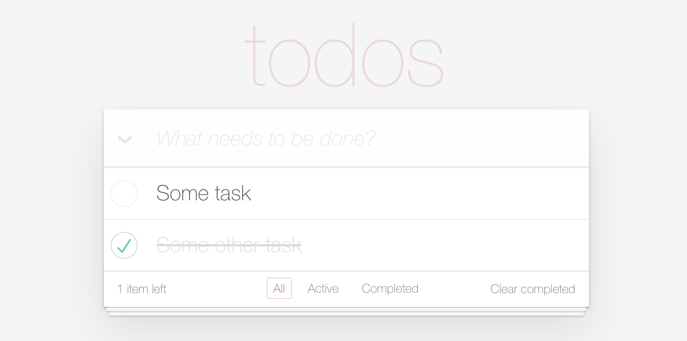

# ✅  Create a Simple Todo List Application

## FAQ

Complete a full-stack implementation in Spring Boot and React to support the following functionality.

An ideal submission would have a:

1.  Minimally complete an API implementation to facilitate the requirements of the client 
2.  Minimally complete a Todo List view to support the functionality listed below.
3.  Add reasonable test coverage on both the API and UI

We'd prefer not to take up more than 2 hours of your time, so no need for:
- any CSS styling 
- configuration or tooling of any type 
    - **Caveat**: Unless your solution or tests require an external dependency your familiar with

we are **more concerned with the foundational criteria mentioned above**. 

_If you aren't able to finish everything, no problem, we can discuss how you'd finish when we review it together_ 🙂

## Functional Requirements

### Add a Todo

New todos are entered in the input at the top of the app.

### Edit & Delete a Todo

A todo item has three possible interactions:

1. Clicking the checkbox marks the todo as complete 

2. Double-clicking input activates editing mode

3. Hovering over the todo shows the remove button

### Counter

Displays the number of active todos

## Submissions

When you are finished, push your commits to the remote.

## Extra

1. Since its such an enjoyable experience to have a todo list, think how would you share it with your friends - so all of you can update it at the same time.

2. Your friends like the todo list a lot! Everyone shared it with their friends. Now your application is bottlenecking. Also everyone edits at the same time just onece a day for an hour. How would you accomodate your users?
